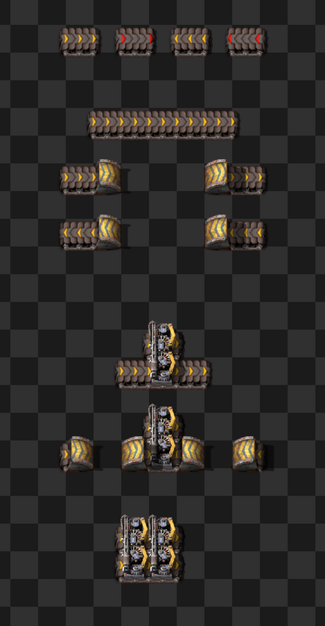
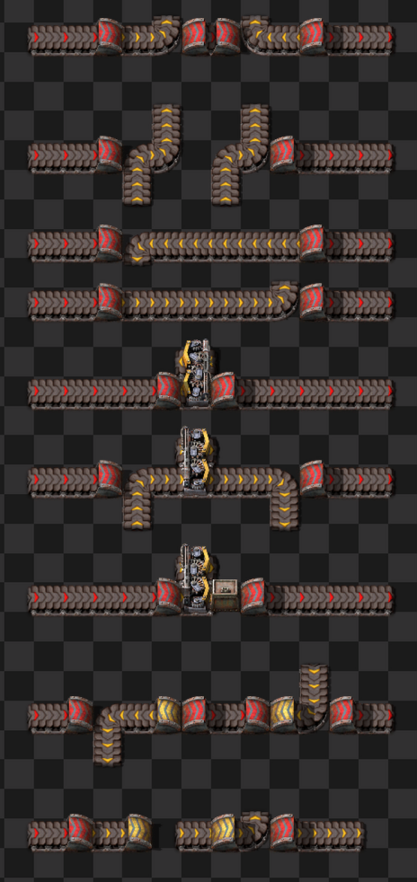
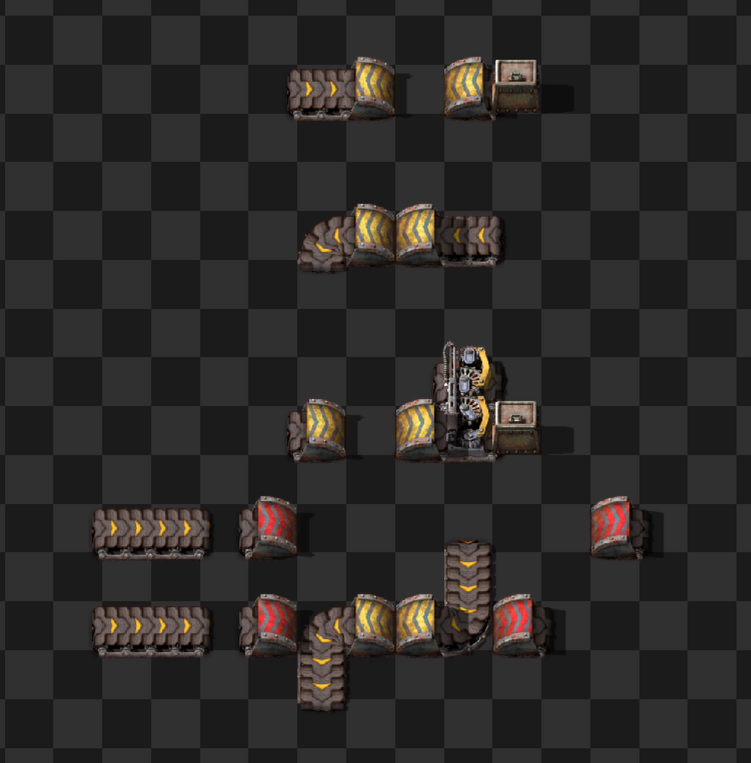
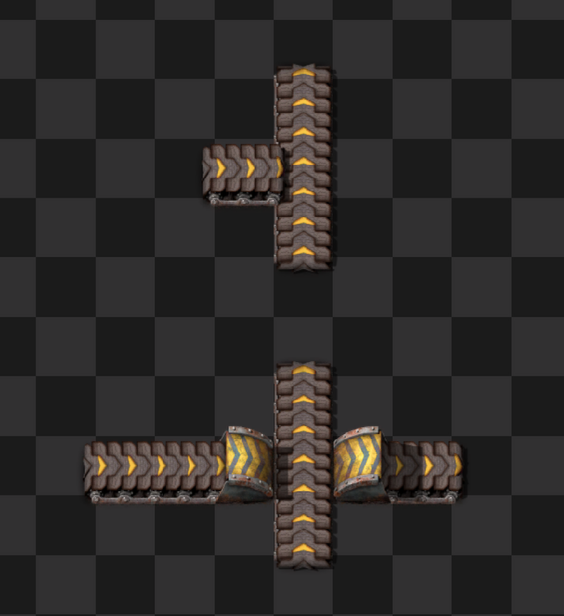
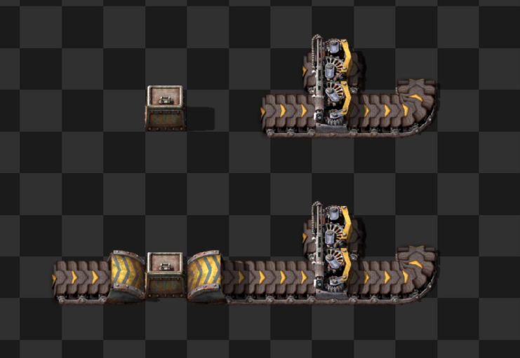
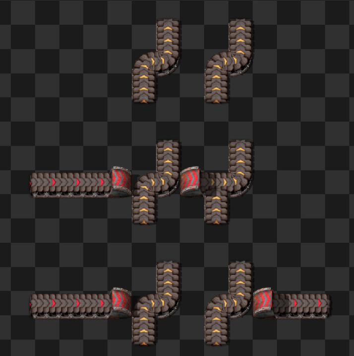

# Smart Belt Specification

## 1. Goals

Enable players to drag belts over obstacles with intuitive, reliable behavior.

Inspiration and sources for this spec include:

- Several smart belt bug reports, which indicate a desire for different behavior. Some highlights:
  - https://forums.factorio.com/viewtopic.php?t=126645
  - https://forums.factorio.com/128742
  - https://forums.factorio.com/128715
  - https://forums.factorio.com/viewtopic.php?t=128845
  - https://forums.factorio.com/viewtopic.php?p=672248
  - https://forums.factorio.com/viewtopic.php?p=675773
- Several discussions with players (especially Factorio Speedrunners), about what should happen in specific situations
- A good think about what makes a smart belt "smart"

### 1.1. Basic Requirements

Basics of what smart belt should do:

- Belt drags in a straight line and automatically places underground belts over obstacles.
- Player is notified when belt lines cannot be completed for any reason.
- Supports dragging belt in forwards and reverse directions.
- Supports rotation.
- Supports undoing actions by "un-dragging" belt in the reverse direction. Newly added in 2.0.61, but we want to support/improve this.
- Incorporates existing compatible belts, splitters, and underground belts going in the same direction as the drag if possible; flipping, rotating, and upgrading them as needed.
- All behavior should be easily understood.

### 1.2. Desired Properties

Tries to pinpoint what it means for smart belt to be "correct". Try comparing these against what's desired in the above bug reports:

- **Continuity**: Belt lines are always continuous and unbroken; the start of a drag will always be belt-connected to the end of the drag.
- **Complete**: Creates a valid belt line if possible, and gives an error if not.
- **Non-interference**: ALL non-integrated entities and belts should be completely untouched. This includes not changing the rotation of an existing belt. This applies even after an error state.
- **Non-destructive**: Forward dragging never deletes existing entities (but may modify incorporated belts).
- **Clean undo**: Backward dragging restores all entities to exactly their previous state.

### 1.3. More Details

Other useful properties:

- Supports belt weaving (underground belts of different tiers don't interfere).
- Support naturally continuing existing belt lines.
- New underground belts are always placed as a pair.
- Support fixing broken underground belts.
- In an error state due to an unplaceable underground belt, the entrance underground belt should be removed.

#### 1.3.1. A note on unpaired underground belts

Currently, unpaired underground belts are treated like belts, and are easily over-built, which might break existing side-loads.
Supporting the former (preserving side loads) would be more complicated, and the value of quickly fixing broken underground belts may be higher.

### 1.4. Nice to Have (Future Extensions?)

- Support un-rotating by pressing rotate twice on the original pivot point.
- Support interactions with ghost belts.

## 2. Obstacle Classification

This section goes into more detail about what counts as an obstacle.

### 2.1. Intro and Examples

Most things are obstacles.
However, some belt lines are obstacles, and some are not.

Examples of non-obstacles.
These should be integrated into the belt line.

Examples of belt which are obstacles, and should be underground-ed over:
Below, all yellow belts are obstacles, and red belt is what would be dragged.

Examples of impossible-to-pass setups.
It's not possible to drag (yellow) belt through these while preserving all goals in Section 1.
As such, the player will be notified with an error if they try to drag a belt through them:

We should also consider all these examples in every rotation and mirroring, and also with dragging belt backwards.

### 2.2. Belt Segments Accessibility

Define a **belt segment** as a series of directly connected belts, underground belts, and splitters.

The above examples show we need to consider belt segments together, not individually, to determine if they should be obstacles.
A rotated belt at the end of a line, or an obstacle in front of a splitter, may change a belt segment's accessibility.

Define this as an **inaccessible belt segment**: as a belt segment that cannot be integrated into the current belt drag, without affecting other non-integrated belt lines.

Smart belt should integrate all accessible belt segments, and not affect any entities of inaccessible belt segments.

#### 2.2.1. Basic belt accessibility rules

To formalize this, all the following are **inaccessible**.

There are only 3 sources of inaccessibility:

- All curved belts; since they go parallel to the current drag.
- Splitters that do not go in the direction of the drag.
- Splitters that do go in the direction of the drag, but we cannot access both the entrance and exit of.

From there, any other belt, underground belt, or splitter that directly connects to another inaccessible belt (segment).

Note, we here only consider belt entities that might connect with a parallel belt; as otherwise, they should always be treated as obstacle

Side-loaded connections do not propagate inaccessibility; this allows dragging over straight perpendicular belts:

#### 2.2.2. Consider only overlapped entities

It's often desirable to end a drag at a straight-then-curved belt (or start a drag on one):

If we considered all belts, the above rules would classify this curved belt as inaccessible.
As such, instead: **Only belts and entities that the current drag has overlapped, may count towards accessibility**

E.g the above would not be considered inaccessible, if we have not yet passed the curved belt at the end.
Only after passing the curved belt, would an underground be created.

#### 2.2.3. Some implementation details

We only need to consider belts and entities the current drag overlaps; belt segments outside this line can only enter the drag area again as a curved or perpendicular belt, which would be considered inaccessible.

All belt accessibility considerations, such as curvature, are done **ignoring** any newly placed belts from the current drag.
The following example demonstrates why:

In the middle, a partial underground is placed, which temporarily straightens a belt. However, the straightened belt should still be considered inaccessible.

### 2.3. Other non-trivial non-obstacles.

- Compatible splitters. Note, we cannot replace a splitter with an underground. As such, if we are going to integrate a splitter, the tile in front and behind it must be free; i.e. we must be able to enter and exit it.

- Underground belts. Any underground belts on the same axis will be passed-through. However, upgrading an underground belt may break the current belt line. We need to handle these cases.

- Fast-replaceable underground belts. See Section 1.3.1.

- Impassable underground belts. These are existing underground belts, of the same tier of the belt we are dragging, that we cannot integrate. It's impossible to create an underground belt over these, so we consider them impassable.

### 2.4. Implementation: Tile Types

This starts to get into implementation details, handling all cases shown above:

We consider all tiles the drag overlaps to be exactly one of the following:

- **Empty**. Placeable tile.
- **Compatible belt**: Existing belt that should be integrated.
- **Fast-replaceable underground belt**: Lonely (unpaired) underground belt that may be replaced with a normal belt.
- **Pass-through underground belt**: Existing paired underground belt that the drag will use. Tiles in between are mostly ignored.
- **Compatible splitter**: Existing splitter that must be integrated.
- **Obstacle**: Blocks belt placement.
- **Impassable obstacle**: Cannot be traversed past (an inaccessible underground belt in the same axis, which would break a new underground belt pair).

### 2.5. Classification Rules

Rules to put all entities into one of the tile types described above:

#### 2.5.1. Transport Belts

- **Perpendicular belts**: Always obstacles.
- **Parallel belts**: Compatible if in an accessible belt segment. Obstacle otherwise.

#### 2.5.2. Splitters (Including 1x1 Splitters)

- **Different direction**: Obstacle.
- **Otherwise**: Follow above accessibility rules.

#### 2.5.3. Underground Belts

- **Perpendicular underground belts**: Always obstacles.
- **Part of accessible belt segment**:
  - Unpaired underground belt: Fast-replaceable (may be replaced with straight belt).
  - Paired underground belt: Pass-through underground belt (dragging belt will mostly ignore tiles in between).
- **Part of inaccessible belt segment**:
  - Different tier of underground belt: Obstacle. This enables belt weaving!
  - Same tier of underground belt: _Impassable_.

#### 2.5.4. Tiles

Some tiles do not allow you to underground over them. These are always **impassable obstacles**.

#### 2.5.5. Other

- **Loaders and all other entities**: Obstacles.

## 3. Straight-Line Dragging

Goes into detail about dragging in a straight line, and traversing obstacles.

### 3.1. The Jist

Place valid underground belts over all obstacle. Integrating compatible belts, splitters, and pass-through undergrounds.
Place new undergrounds over all obstacles, possibly replacing old entities with underground belts.
If it is impossible to do so, notify the user error at the first problematic position.

Never affect non-integrated entities.

### 3.2. Basic Expected Behavior

Note: there are a lot of details missing to turn this into a complete implementation! See [[impl_outline.md]] for a more detailed view.

For every new tile dragged:

- If possible, place a new belt.
- If just going past an obstacle, create an underground belt connecting the last valid underground belt entrance position. Remove the old exit underground, if already placed.
- If encountering an impassable obstacle, report an error immediately.
- If going through a pass-through underground belt.
  - If the underground belt needs to be upgraded, check:
    - If the belt is downgraded, ensure that the belt is still able to connect to both ends. If not, report an error.
    - If the belt is up/downgraded, and there are any impassable underground belts inside, report an error; upgrading would change the pair! This ensures that you don't break belt weaving by upgrading.
  - Otherwise, ignore everything else, until passing the exit underground belt.
  - If it's not possible to place a new entity past the exit underground belt, report an error.

### 3.3. Special Handling for First Belt Segment

Similarly to as described in Section 2.2.2., we (may) want to treat the first belt segment specially, even if they would otherwise be inaccessble. This allows naturally continuing existing belt lines.

Note that we do not consider entities behind the first belt, as per Section 2.2.2.

Consider a otherwise inaccessible belt segment: 

To count as an "connected" first belt segment, it must first start with 1 or more belts, splitters, and undergrounds in the same direction as the drag.

The first entity that does not, and would make the first belt segment inaccessible, can only be the following (from Section 2.2.1.):

- If it's a curved belt:
  - Option 1: error and do nothing.
  - Option 2: straighten it out and continue. This ends the belt segment.
  - **This is TBD! These NEW behaviors should discussed. Please leave feedback on what you think make the most sense.**
- If it's a splitter, it must be in the same direction as the drag. The only way this can be an inaccessible belt segment, is if the output is blocked. In this case, we can treat this the same as a blocked underground belt; just give an error.

### 3.4. Error Handling

What do do when we cannot continue:

- If due to trying being unable to place/extend an underground belt, remove the underground belt entrance. This is so we don't side load/curve into anything.
- If due to a pass-through underground we cannot upgrade, do not upgrade the underground belt.
- IF the output is blocked, notify the player that "X is in the way."

### 3.5. Placing Entities

Final notes on placing and "overlapping" existing entities:

- **Empty space**: Create the entity.
- **Compatible belts/underground belts**: Rotate, upgrade, or fast-replace as needed.
- **Compatible splitters**: Rotation should not be necessary. TBD: Should we also upgrade the splitter? It currently doesn't today.

## 4. Full Drag Operations

Logic for the full "drag lifecycle": starting, rotating, and "un-dragging".

### 4.1. Starting a Drag

#### 4.1.1. Basic behavior

A drag starts when the player places and holds down a belt.
A drag is created in the same line as the belt.
Dragging forwards or backwards determines the belt orientation.
You can un-drag to flip between forward and backward.

#### 4.1.2. Fast Replace on the First Entity

The very first click is special: it may fast replace something (such as replace a splitter with a belt, or remove an underground).

This should be excluded from any of the other rules here; this allows the user to override any behavior here by simply clicking again.

Since it's logically a separate operation, a change due to _fast-replace_ should also be a separate undo/redo item from the drag.

#### 4.1.3. Valid vs Invalid Starting Position

Behavior may differ depending on whether the start position is "valid" or not.

We consider a start position **valid** if the first belt is successfully placed, resulting in a belt in the same direction as the drag.

If the start position is not valid, due to being blocked, an error sound plays.
However, continuing to hold and drag may start a new drag at the first placeable position afterwards. We treat this as starting a new drag at that point.

However, there are some differences. Following the principle of clean undo:

- A valid first belt can never be removed by dragging, only maybe replaced with an underground belt.
- An invalid first belt (started elsewhere) _must_ be removed by backward dragging.
- While flipping direction changes belt line direction (forward/backward). flipping direction should NOT create underground belts (current game behavior).

### 4.2. Rotation

#### 4.2.1. Basic behavior

Rotation happens when pressing rotate in the middle of a drag, perpendicular to the belt line.
This is very similar to starting a drag, with the following differences:

- Un-dragging and flipping direction changes the rotation direction (left/right), not belt direction (forward/backward).

TBD decide on one of these:
- A rotation _cannot_ be started at an invalid position; e.g. no rotation is created.
- A rotation at an invalid position is treated similarly to starting a drag at an invalid position;

#### 4.2.2. Rotation Position Validity

If the start position of a rotation is valid, is slightly more strict:
It must be a belt, that the current belt line runs directly into.

Note: allow the rotation point to be a curved belt! This allows merging into, then continuing, a curved belt end, like as shown in Section 2.2.2.

This is better explained visually.

#### 4.2.3. Starting a Rotation

When initiating a rotate:

- The pivot belt is rotated to the previous drag direction, if needed.
- Dragging left or right creates a new drag, in a perpendicular direction.
- If un-dragging all the way back to the pivot, straighten the pivot belt back to the previous drag direction.

#### 4.2.4. Possible Enhancements?

- Hitting rotate twice on the pivot belt continues the PREVIOUS drag. This would allow saying, "Oops, I didn't want to rotate here."

### 4.3. Un-dragging

Un-dragging always undoes actions performed by the current drag.

TO DECIDE: How rich of an undo support we want to provide. Allow restoring settings/ghosts? Hijack the existing undo stack?

There is no need for special redo; when dragging forwards again, we just evaluate the world again; this may even have different behavior if entities have changed.

Some consequences of a clean undo:

- Only placed belts can be mined.
- Only rotated belts can be rotated.
- Un-dragging may _place_ entities (underground belts previously deleted).

## 5. Other Feature Interactions

### 5.1. Undo/Redo Stack

- Un-dragging may need to manage a "mini" undo stack, but we also have the MAIN undo/redo stack.

These should be Ctrl+Z undoable:

- The very first belt's fast replace, if applicable.
- All belts placed in the last straight-line drag.
- Rotating ends the current straight-line drag and starts a new one, creating a new undo action.

### 5.2. Ghosts and ghost building

- **Real belt dragging**: Ghosts completely ignored.
  - Future enhancement: Interactions with ghosts (a.k.a. a séance).
- **Ghost belt dragging**: Both ghosts and real entities considered.

### 5.3. Force building

Force is only different from normal ghost placement, in that rocks and trees are no longer considered obstacles.

### 5.4. SUPER force building

If using super force, any potential obstacles (belt or otherwise) are deleted/force-integrated (rotated/upgraded); then treated as integratable tiles for the rest of this spec.

If you release super-force, future encountered entities are treated normally again.

### 5.5. Entities Marked for Deconstruction

- **Real entity dragging**: Deconstructed entities _always_ treated as obstacles (if there is collision), even if they would otherwise be integrated.
- **Ghost dragging**: Deconstructed entities completely ignored.

### 5.6. Player Interactions

- **Material shortage**: Match existing behavior for now; running out of real belts ends the drag. This means you can't undo anymore, but dealing with this is complicated.
- **Insufficient underground belts**: Creates ghosts instead (with error notification). This will mine the input underground belt position.
- **Upgrades**: Either places upgraded materials or marks for bot upgrade, depending on whether ghost dragging is active and whether the player has enough materials.
