Smart Belt Specification

# Introduction, goals, and examples

## Sources

Inspiration and sources for this spec include:

- Many smart belt bug reports, which indicate a desire for different behavior. Some highlights:
  - https://forums.factorio.com/viewtopic.php?t=126645
  - https://forums.factorio.com/128742
  - https://forums.factorio.com/128715
  - https://forums.factorio.com/viewtopic.php?t=128845
  - https://forums.factorio.com/viewtopic.php?p=672248
  - https://forums.factorio.com/viewtopic.php?p=675773
- Several discussions with players (especially Factorio Speedrunners), about what should happen in specific situations
- A good think about what makes a smart belt "smart"

## Goals

Enable players to drag belts over obstacles with intuitive, reliable behavior.

### Basic Requirements

- Belt drags in a straight line and automatically places underground belts over obstacles.
- Player is notified when belt lines cannot be completed for any reason.
- Supports dragging belt in forwards and reverse directions.
- Supports rotation of the current drag.
- Incorporates existing compatible belts, splitters, and underground belts going in the same direction as the drag if possible; flipping, rotating, and upgrading them as needed.
  - This allows flipping and existing belt.
- All behavior should be easily understood.

### Desired Properties

Tries to pinpoint what it means for smart belt to be "correct". Try comparing these with the above bug reports:

- **Continuity**: In the absence of "errors", belt lines are continuous and unbroken; the start of a drag will always be belt-connected to the end of the drag.
- **Complete**: Creates a valid belt line if possible (from below rules). Always notifies the player with an error if not.
- **Non-interference**: ALL non-integrated entities and belts should be untouched. This means not changing the rotation of another belt.

### Desired capabilities

- Supports belt weaving (underground belts of different tiers don't interfere).
- Support "naturally" continuing existing belt lines.

#### Unpaired underground belts

New underground belts are always placed as a pair; no lonely underground belts.

However, for existing unpaired underground belts, we currently just always fast-replace them and treat it like belt.
This might break existing side-loads.
Supporting the former (preserving side loads) would be more complicated, and not too much of a value add.
We relegate this to a potential future extension/modification.

## Motivating examples

These show some particular examples that motivate many of the decisions in this spec.

All examples are when dragging left to right.

Images generated using [Factorio-Sat](https://github.com/R-O-C-K-E-T/Factorio-SAT), which is licensed under GNU GPL.
Made simple modifications to get it to work with 2.0.

### Simple cases

#### Non-obstacles

These should be integrated into the belt line.

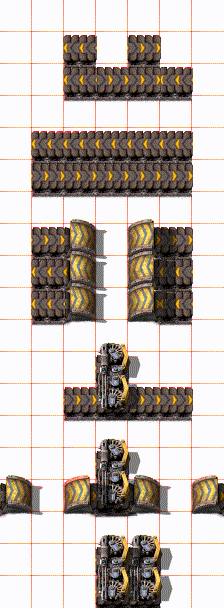

#### Obstacles

These should be under grounded over.

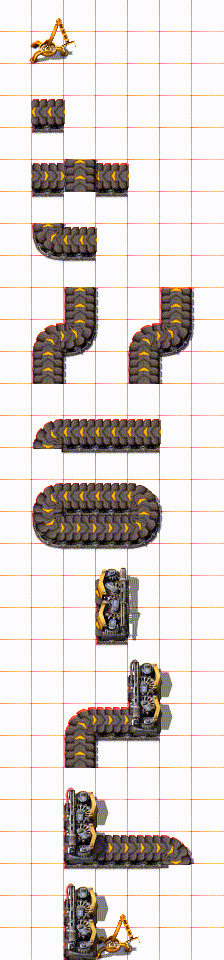

For this red belt can underground over it, allowing belt-weaving.

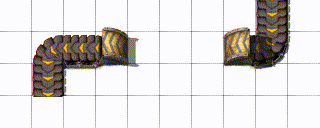

#### Impassable obstacle

These are *not possible* to underground over;
the player will be notified with an error (X is in the way) if they try to drag a belt pass them.

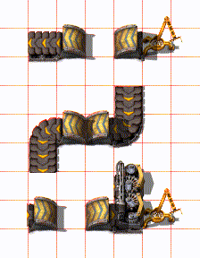

#### Random other examples

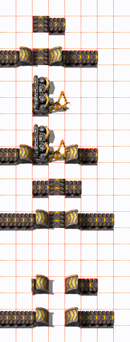

### Tricky cases

#### Curved belt?

When we run into an existing belt (or underground belt) in the same direction as the drag, we *always* attempt to integrate it.
(More motivation for this rule comes later)

However, if we then run into a curve, trying to underground over it, or straighten the curved belt, may break an existing belt line.
As such, if we try to traverse past the curved belt, we give up and give an error.

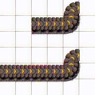

However, in other cases we sometimes want to jump over belt segments given the choice.

#### Running into a splitter

We would like to underground over side balancers, when running over the unused input:

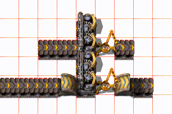

But if we can use the output (it's all straight), we should integrate instead of underground over:

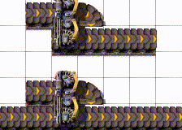

However, if input is actually *used* (has at least one belt input into it), it's less clear if we should integrate or underground over it.
The compromise chosen is to always not underground, even if the splitter later runs into a dead end.

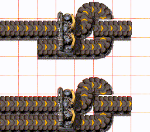

This motivates treating belt segments starting with a splitter differently:

- When running into *forwards* belt or an entrance underground, we *always* integrate it.
- However, if it *starts* with a splitter, we lookahead to see if we want to integrate or underground over it.

The player can override this behavior by stopping then starting a new drag right before the splitter.

#### Running into a *backwards* belt

(not a backwards underground belt)

For backwards belt, we want to lookahead to decide if we underground over it, or integrate it.

2 example cases:

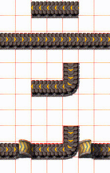

HOWEVER, we don't want infinite lookahead: With infinite lookahead, dragging ghost belt to upgrade this will stop at the splitter, and eventually say "underground too long". This is even if you don't end up dragging all the way to the curved belt:

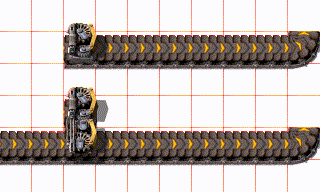

As such, we limit our lookahead to up to as far as the last underground can reach.

- If we can underground over the whole thing, do it
- If it's too long, integrate it.
  Note: there's also some cases where it's impossible to underground over the belt segment.

This won't satisfy everyone in every single situation, but seems a decent compromise:
it's possible to tell at a glance what behavior you'll get; you can still override the default behavior by dragging twice in these cases.

# THE SPEC

Starting to make things formal, handling all cases shown earlier.

## Obstacle/tile classification

Some definitions:

- **Belt-like entity**: a belt, ug belt, or splitter (including 1x1)
- **Belt segment**: is a series of directly connected belts, underground belts, and splitters; only considering entities in the path of the current belt drag.
  Side-loading does not count towards belt segment connectivity.

### Informally

For every tile:

If you can't place belt on it, it's an obstacle or impassable obstacle, depending on if possible to underground past it.

Tricky cases are with existing belt-like entities.
We want to treat these an entire **belt segment** at a time.

- Perpendicular belts-like entities, and backwards splitters are obstacles.
- Curved belts are also obstacles.

For any belt segment, that we run into:

- Curved or perpendicular belt-like entities are obstacles.
- If the belt drag connect *directly* into it belt segment facing the same direction, starting with a belt or input underground, we *always* integrate it.
  - Even if it later leads to a dead end.
- If we can't connect into a belt segment (input blocked spitter), it's an obstacle.
- In remaining cases, we have belt segments that begin with a backwards belt, or a forwards splitter. We have a choice: if it's possible to integrate the *entire belt segment* (all straight, no curved belt, no backwards splitter), we use it.
  Otherwise, it's an obstacle and we try undergrounding over it.

Only consider belt segments for a limited number of blocks ahead of the current position, to avoid infinite lookahead and potentially unintuitive behavior.

All these create impassable obstacles:

- The tile doesn't allow under-grounding through
- If we are dragging over an existing belt segment that is integrated, and the belt segment curves
- If we encounter a underground belt of the *same* tier and axis, that we aren't integrating (are trying to underground ove it). This is an impassable obstacle as it would break any underground we try to build over it.
- Trying to upgrade an underground, if it would:
  - make it too short
- break belt weaving (will pair with something else instead)

**Variations**:
Some things we're not 100% sure about, and might consider:

- Forwards belt should not *always* be force integrated, in some cases?
- Forwards splitters should not be given special treatment

### Formally

See \[\[prototype\_abstract/src/smart\_belt/tile\_classification.rs\]\], which aims to be self-documenting code.

#### A note on belt curvature

Belt curvature is considered **ignoring** newly placed belts from the current drag.
See this example:

In the middle, a partial underground is placed, which temporarily straightens a belt. However, the straightened belt should still be considered inaccessible.

## Straight-Line Dragging

After we have classified obstacles, we need to actually place underground belts.
This goes into detail about how belts are placed.

### Informally

Integrate compatible belts, splitters, and pass-through undergrounds.
Place underground belts over obstacles; Keep track of the last valid input underground position.
When encountering a new obstacle, always place a new underground belt if its possible to do so; else, extend the last underground if possible.
If encountering an impassable obstacle, or underground belt would be too long, give up, and notify the user.

Never affect non-integrated entities.

### Formally

See [drag\_logic.rs](prototype_abstract/src/smart_belt/drag_logic.rs), which aims to be self-documenting code.

### Placing entities

Final notes on placing entities.

- Placing a belt may fast replace or rotate an existing belt.
- Integrating an entity: means, upgrading and rotating a underground belt/splitter as necessary.

## Full drag operation

For starting, backtracking, and rotating a drag.

### Starting a Drag

A drag starts when the player places and holds down a belt.
A drag is created in the same line as the belt.
Dragging forwards or backwards determines the belt orientation.
Un-dragging backwards changes the belt orientation.

### Fast Replace on the First Entity

The very first click is special: it may fast replace something (such as replace a splitter with a belt, or remove an underground).
This behavior is independent from any other rules here; This allows the user to override any behavior by simply clicking another time.
If a fast replace is done, this may also create a separate undo/redo item; allows recovering from "accidental" dragging.

### Rotation

When pressing rotate in the middle of a drag, determine the direction (left/right) by where the cursor is.
The belt direction (forwards/backwards) will match what it was previously.

If the "pivot tile" is a belt: first rotate it to the correct direction if needed, whatever the previous orientation was\!

- or follow fast replace rules: if it can be fast replaced with a belt in the correct direction, do it.

If it is not a belt, classify the tile as if the "previous" tile was empty (even though the "previous" belt is empty).
This allows running into a underground belt sideways, then continuing over it.

Otherwise, it's the same as starting a new drag at the pivot point.

## Other Feature Interactions

### Undo/Redo Stack

These should separate undo items:

- The very first belt's fast replace if applicable.
- Each "segment" of a a drag; rotation ends the current segment and starts a new one

### Ghosts and ghost building

- **Real belt dragging**: Ghosts completely ignored.
  - Future enhancement: Interactions with ghosts?
- **Ghost belt dragging**: Both ghosts and real entities considered.

This is considered one entity at a time, at the time when you placed the belt.

TODO: exceptions

### Force building

This always results in ghost placement.

Force is only different from normal ghost placement, in that rocks and trees are no longer considered obstacles.

### SUPER force building

If using super force, any potential obstacles, belt or otherwise, are either deleted (if not a belt) or force-integrated
(if it happens to be the correct type);
then treated as integrable belt for the rest of this spec.

If you release super-force, future encountered entities are treated normally again.

TODO: formalize this

### Entities Marked for Deconstruction

For deconstructed entities:

- **Real entity dragging**:
  - if it is possible to fast-replace with a straight belt, this is done; and the belt is un-deconstructed
  - otherwise, treated *normal* obstacles. Underground belt interactions are ignored
- **Ghost dragging**: Deconstructed entities completely ignored.

TODO: formalize this

### Player Interactions

- **Material shortage**: running out of real belts ends the drag.
- **Insufficient underground belts**: Creates ghosts instead (with error notification). This will also mine the input underground belt position to prevent accidental sideloads.
- **Upgrades**: Either places upgraded materials or marks for bot upgrade, depending on whether ghost dragging is active and whether the player has enough materials.
