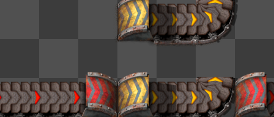
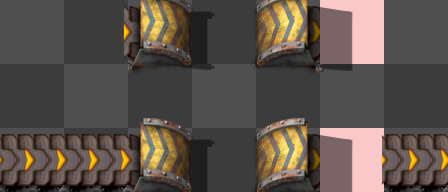

# New Smart Belt Specification

## Inspiration and Sources

Inspiration and sources for this spec include:

- Many smart belt bug reports, which indicate a desire for different behavior. Some highlights:
  - https://forums.factorio.com/viewtopic.php?t=126645
  - https://forums.factorio.com/128742
  - https://forums.factorio.com/128715
  - https://forums.factorio.com/viewtopic.php?t=128845
  - https://forums.factorio.com/viewtopic.php?p=672248
  - https://forums.factorio.com/viewtopic.php?p=675773
- Several discussions with players (especially Factorio Speedrunners), about what should happen in specific situations
- A good think about what makes a smart belt "smart"

## Goals

Enable players to drag belts over obstacles with intuitive, reliable behavior.

### Basic Requirements

- Belt drags in a straight line and automatically places underground belts over obstacles.
- Player is notified when belt lines cannot be completed for any reason.
- Supports dragging belt in forwards and reverse directions.
- Supports rotation of the current drag.
- Incorporates existing compatible belts, splitters, and underground belts going in the same direction as the drag if possible; flipping, rotating, and upgrading them as needed.
- All behavior should be easily understood.

### Desired Properties

Tries to pinpoint what it means for smart belt to be "correct".
Try matching theContinuity\*\*: In the absence of "errors", belt lines are continuous and unbroken; the start of a drag will always be belt-connected to the end of the drag.

- **Complete**: Creates a valid belt line if possible (from below rules). Always notifies the player with an error if not.
- **Non-interference**: ALL non-integrated entities and belts should be untouched. This also means not changing the rotation of another belt.

### Desired capabilities

- Supports belt weaving (underground belts of different tiers don't interfere).
- Support "naturally" continuing existing belt lines.

# Motivating examples

These show some particular examples that motivate many of the decisions in this spec.

All examples are when dragging left to right.

Images generated using a script derived from parts of [Factorio-Sat](https://github.com/R-O-C-K-E-T/Factorio-SAT), which is licensed under GNU GPL v3.
Made simple modifications to get it to work with 2.0.

## The ambiguous cases

These are cases where it's somewhat ambiguous what the correct behavior is; and the decision that this implementation decided to go with.
This also shows where the spec deviates from suggestions I've gotten from some people.

### Running into a matching belt, leading to a curved belt

First, this spec forward-checks multiple belts together as a segment in some cases, to see if we should underground past it:
The above is one interesting/exception to this, though:

When handling this the case,we don't want to rotate curved belt, as that might break an existing belt line.
If we DO integrate the segment, then we have no choice but to fail (give the user an error message).
As such, there's an argument to be made, to not try to integrate the belt segment (the lower case).

However, consider the following case, where segment is too long to underground past:

This case demonstrates why this alternate behavior was rejected, in favor of *always* integrating the belt segment *if it starts with a same-direction belt*.

- If we try to jump over a long segment, then this leads to long-distance dependencies, as a curved belt really far away would affect the current drag.
  This would be surprising if e.g. you were trying to upgrade a long belt segment that later ends in a turn.
- If we decide to only jump over the segment, depending on the current underground belt's reach distance, then this might lead to strange behavior depending on what tier belt you are using.
  If you have a long reach underground, it can suddenly be hard to drag belt into turns
- It may be more intuitive to always integrate such segments, as it starts "compatible" with the drag.

Also note, this always-integrate exception doesn't apply if the segment starts BACKWARDS:

### Running into a splitter, leading to a curved belt

In contrast to the normal belt case above, a splitter followed by a curved belt within underground reach distance *does* become an obstacle.

Current game behavior suggest something like this is desirable, to handle the rather common belt balancer case:

Additionally, *not* undergrounding over this will later result in a failure. So undergrounding over this makes sense.
NOTE: the exception for *normal* belt in the previous section still applies.

### Not extending existing underground belt

If you use an existing underground belt, and it runs into an obstacle, smart belt will *not* try to extend it past the obstacle.
This is since it's very possible for that output position to be used.

- Future extension (?) Actually check if the output position is used, instead of assuming it.

### Error recovering

Belt continues after error:
Right now, after a failure, you can keep building belt on the next available tile.

An alternative is to stop the drag completely on any error. However this might lead to frustrating behavior where your belt always suddenly ends.
It also becomes unclear what the behavior should be, when the drag starts when hovering over an obstacle.

It's also possible to remove the input belt on an error, in case that changes the curvature of another belt.
However, this might be undesirable, if it was actually your intent to connect to the next belt, but just accidentally dragged too far.

In summary, this spec considers just the "error sound" and notification to be sufficient for error handling.

## Notable cases

Showing new features and behavior.

#### Belt weaving is supported

#### Running into the back of an underground is conditionally an obstacle

- If the segment ends in a curved belt
- If it's has a underground pair, and is a different tier

#### Undergrounds will not be upgraded if that would break it

These will give failure messages:

Too short:

Intercepting underground:

However, the underground will at least be rotated if needed.

#### Smart segment handling

This case *is* handled. This requires considering belt curvature *before* our entities were placed.

# Older spec

Below is contents of an earlier draft of the spec. Less explanatory, but still useful.

### Simple cases

#### Non-obstacles

These should be integrated into the belt line.

#### Obstacles

These should be under grounded over.

For this red belt can underground over it, allowing belt-weaving.

#### Impassable obstacle

These are *not possible* to underground over;
the player will be notified with an error (X is in the way) if they try to drag a belt pass them.

#### Random other examples

### Tricky cases

#### Curved belt?

When we run into an existing belt (or underground belt) in the same direction as the drag, we *always* attempt to integrate it.
(More motivation for this rule comes later)

However, if we then run into a curve, trying to underground over it, or straighten the curved belt, may break an existing belt line.
As such, if we try to traverse past the curved belt, we give up and give an error.

However, in other cases we sometimes want to jump over belt segments given the choice.

#### Running into a splitter

We would like to underground over side balancers, when running over the unused input:

But if we can use the output (it's all straight), we should integrate instead of underground over:

However, if input is actually *used* (has at least one belt input into it), it's less clear if we should integrate or underground over it.
The compromise chosen is to always not underground, even if the splitter later runs into a dead end.

This motivates treating belt segments starting with a splitter differently:

- When running into *forwards* belt or an entrance underground, we *always* integrate it.
- However, if it *starts* with a splitter, we lookahead to see if we want to integrate or underground over it.

The player can override this behavior by stopping then starting a new drag right before the splitter.

#### Running into a *backwards* belt

(not a backwards underground belt)

For backwards belt, we want to lookahead to decide if we underground over it, or integrate it.

2 example cases:

HOWEVER, we don't want infinite lookahead: With infinite lookahead, dragging ghost belt to upgrade this will stop at the splitter, and eventually say "underground too long". This is even if you don't end up dragging all the way to the curved belt:

As such, we limit our lookahead to up to as far as the last underground can reach.

- If we can underground over the whole thing, do it
- If it's too long, integrate it.
  Note: there's also some cases where it's impossible to underground over the belt segment.

This won't satisfy everyone in every single situation, but seems a decent compromise:
it's possible to tell at a glance what behavior you'll get; you can still override the default behavior by dragging twice in these cases.

# THE SPEC

# IMPORTANT: This is outdated

It turns out there's a lot more details when we get to implementation, that needed to be ironed out, deviating from this doc.
Instead, refer to [prototype\_abstract/src/smart\_belt](prototype_abstract/src/smart_belt/mod.rs), which aims to be well documented, explanatory code\!

## Other Feature Interactions

### Undo/Redo Stack

These should separate undo items:

- The very first belt's fast replace if applicable.
- Each "segment" of a a drag; rotation ends the current segment and starts a new one

### Ghosts and ghost building

- **Real belt dragging**: Ghosts completely ignored.
  - Future enhancement: Interactions with ghosts?
- **Ghost belt dragging**: Both ghosts and real entities considered.

This is considered one entity at a time, at the time when you placed the belt.

Exceptions:

- Ghost belts are still considered for normal placement, but only to determine *belt curvature*.

### Force building

This always results in ghost placement.

Force is only different from normal ghost placement, in that rocks and trees are no longer considered obstacles.

### SUPER force building

If using super force, any potential obstacles, belt or otherwise, are either deleted (if not a belt) or force-integrated
(if it happens to be the correct type);
then treated as integrable belt for the rest of this spec.

### Entities Marked for Deconstruction

For deconstructed entities:

- **Real entity dragging**:
  - If it is possible to fast-replace it with a straight belt, it is
  - Otherwise, it is treated as a *normal* obstacle.
- **Ghost dragging**: Deconstructed entities ignored.

### Player Interactions

- **Material shortage**: running out of real belts ends the drag.
- **Insufficient underground belts**: Creates ghosts instead (with error notification). This will also mine the input underground belt position to prevent sideloads.
- **Upgrades**: Either places upgraded materials or marks for bot upgrade, depending on whether ghost dragging and if the player has enough materials.
