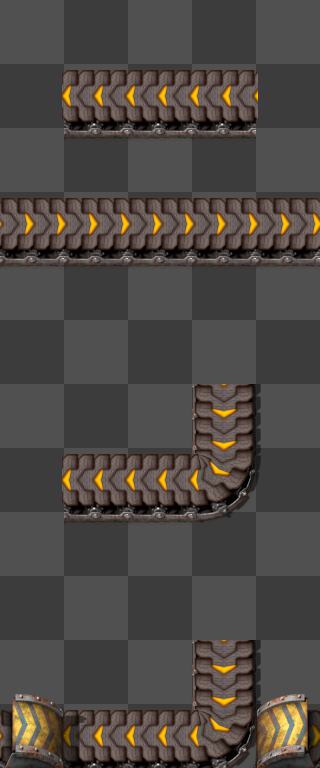
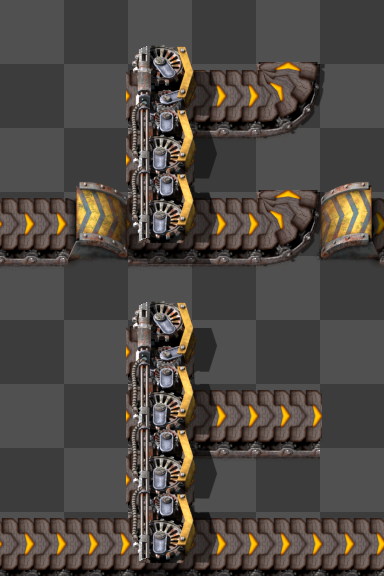
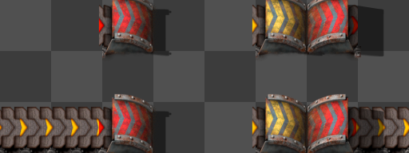
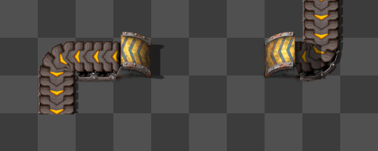
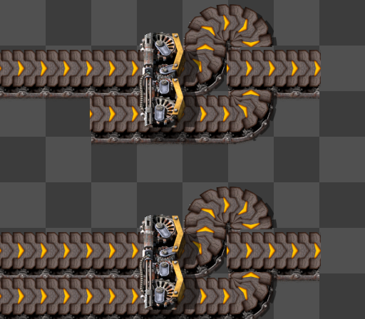

# New Smart Belt Specification

## Inspiration and Sources

This specification draws from:

- Smart belt bug reports indicating desired behavior changes. Key examples:
  - https://forums.factorio.com/viewtopic.php?t=126645
  - https://forums.factorio.com/128742
  - https://forums.factorio.com/128715
  - https://forums.factorio.com/viewtopic.php?t=128845
  - https://forums.factorio.com/viewtopic.php?p=672248
  - https://forums.factorio.com/viewtopic.php?p=675773
- Discussions with players (especially Factorio Speedrunners) about expected behavior in specific situations
- Careful consideration of what makes a smart belt "smart"

## Goals

Enable players to drag belts over obstacles with intuitive, reliable behavior.

### Basic Requirements

- Belt drags in a straight line and automatically places underground belts over obstacles.
- Player receives notification when belt lines cannot be completed.
- Supports dragging belts in forward and reverse directions.
- Supports rotation during drag.
- Incorporates existing compatible belts, splitters, and underground belts traveling in the same direction; flips, rotates, and upgrades them as needed.
- All behavior is easily understood.

### Desired Properties

Defines what makes smart belt behavior "correct". Try matching these to the bug reports above.

- **Continuity**: Without errors, belt lines are continuous and unbroken; the start of a drag is always belt-connected to the end.
- **Complete**: Creates a valid belt line when possible, by the rules defined here. Always notifies the player with an error if not.
- **Non-interference**: All non-integrated belts remain unaffected, including their rotation.

### Desired Capabilities

- Supports belt weaving: underground belts of different tiers don't interfere.
- Supports naturally continuing existing belt lines.

### Consequences

A few principles derived from above:

- If we integrate/connect to an existing a belt segment, we must use the entirety of the segment.
- If we DO connect to a belt segment and we cannot continue it later, we must fail (notify player with error).
- If the last tile was a belt we integrated, and the current tile is belt-connected to it, we must try to integrate the current tile, or else fail.
- If the last tile was a obstacle, and the current tile is belt-connected to it, we must treat the current tile as an obstacle.
- In cases where we have a choice if we want to  integrate a segment or underground over it; we will scan the belt segment ahead:
  - If we can integrate the entire belt segment and continue it without errors, we integrate
  - If we can't integrate the entire belt segment (will cause belt line to be not continuable) but can successfully underground over it, we underground over it
  - Otherwise, we are forced to integrate it, and will encounter an error later.

# Motivating Examples

All examples here are before/after, dragging left to right.

This has contents from an earlier draft. Less explanatory, but still here for higher completeness.
See also the [test\_suite](./test_suite) for a complete overview of handled cases.

Images generated using a script derived from [Factorio-Sat](https://github.com/R-O-C-K-E-T/Factorio-SAT), licensed under GNU GPL v3, with modifications for 2.0 compatibility.

## Notable Cases

Demonstrating a few salient features.

### Smart segment handling

This case is handled correctly by considering belt curvature *before* entities were placed:

### Segment checking

When encountering certain belts, when deciding if it is is an obstacle or not, we will scan ahead a few tiles of the *belt connected* segment:

If see a any of these features within under ground distance, we treat the entire segment as an obstacle, since these would break the belt segment

- Curved belt
- Backwards splitters
- Directly connected loader

Conditions we start a segment scan:

- Backwards belt segment
- Forwards splitter
- Unpaired underground belt, where the underground "entrance/exit" is facing forward.

If we DON'T see any of these features, OR we encounter something that makes undergrounding over the segment impossible,
the we DO integrate the belt segment.

Examples:

### Undergrounds will not be upgraded if upgrading would break it

Due to the following reasons:

**Too short**:

**Intercepting underground**:
Another underground belt that cuts the link we want to have:

However, in these cases, undergrounds may still be rotated.

### Belt weaving

## Ambiguous Cases and Design Decisions

Cases where the correct behavior is debatable, showing the chosen implementation and where it deviates from some player suggestions.

### Running into a forward belt, leading to a curved belt

As stated before, in some cases we forward-scan a belt segment to determine whether to underground over it or not.
However, when encountering a forwards belt, the desired behavior is unclear:

- We don't want to rotate existing belts, as that might break a belt lines. So, if we choose to integrate the segment, we must fail with an error message.
- Because of the failure, it may be desirable to underground over the small segment.

However, consider when the segment is too long to underground over:

This case shows why this spec chooses to *always* integrate belt segment, *if they start with a same-direction belt*:

If we try to underground over forward segments:

- This creates long-distance dependencies, especially if you have a long-reaching underground belt. With long-reach undergrounds, dragging belts into turns becomes unexpectedly difficult.
- Always integrating compatible segments may be more intuitive, since they start seemingly "compatible" with the drag.

Note: This always-integrate rule doesn't apply if the segment starts backwards:

### Running into a splitter, leading to a curved belt

Unlike normal belts, a splitter followed by a curved belt within underground reach *does* become an obstacle.

Current game behavior suggests this is desirable for the common belt balancer case:

Additionally, not undergrounding here would later result in failure, so undergrounding makes sense.
NOTE: The exception for normal belts in the previous section still applies.

### Not extending existing underground belt

If an existing underground belt encounters an obstacle, smart belt will *not* extend it past the obstacle, since the output position may already be in use.

- Future extension: Actually check if the output position is used, rather than assuming it is.

### Error Recovery

After a failure, belt construction continues on the next available tile.

Alternatively, the drag could stop completely on any error. However, this creates frustrating behavior where belts unexpectedly end. The behavior when starting a drag over an obstacle would also be unclear.

Another option is removing the input belt on error if it changes another belt's curvature. However, this may be undesirable if connecting to the next belt was intentional but the drag went too far.

This spec considers the error sound and notification sufficient for error handling.

## Older examples

This are examples from an earlier draft. Less explanatory, but still here for higher completeness.

See also the [test\_suite](./test_suite) for a complete overview of handled cases.

### Simple Cases

#### Non-obstacles

These should be integrated into the belt line:

#### Obstacles

These should be undergrounded over:

Red belts can underground over lower-tier belts, enabling belt-weaving:

#### Impassable Obstacles

These are *not possible* to underground over. The player receives an error (X is in the way) when attempting to drag a belt past them:

#### Additional Examples

### Tricky Cases

#### Curved Belt

When encountering an existing belt (or underground belt) in the same direction as the drag, we *always* attempt to integrate it. (More motivation for this rule comes later.)

However, if we encounter a curve, undergrounding over it or straightening the curved belt may break an existing belt line. If we try to traverse past the curved belt, we fail with an error.

In other cases we sometimes want to jump over belt segments.

#### Running into a Splitter

We should underground over side balancers when running over the unused input:

But if we can use the output (it's all straight), we should integrate rather than underground over:

However, if the input is actually used (has at least one belt feeding into it), it's unclear whether to integrate or underground over. The compromise is to never underground, even if the splitter later reaches a dead end.

This motivates treating belt segments starting with splitters differently:

- When encountering a *forward* belt or entrance underground, we *always* integrate it.
- However, if it *starts* with a splitter, we lookahead to decide whether to integrate or underground over it.

Players can override this behavior by stopping and starting a new drag right before the splitter.

#### Running into a Backwards Belt

(Not a backwards underground belt)

For backwards belts, we lookahead to decide whether to underground over or integrate.

Example cases:

However, infinite lookahead is undesirable. With infinite lookahead, dragging ghost belts to upgrade would stop at the splitter and eventually report "underground too long", even without dragging all the way to the curved belt:

Therefore, we limit lookahead to the last underground's reach distance:

- If we can underground over the entire segment, do it.
- If it's too long, integrate it.

Note: Some cases make it impossible to underground over the belt segment.

This won't satisfy everyone in every situation, but provides a reasonable compromise: behavior is predictable at a glance, and players can override defaults by dragging twice.

# THE SPEC: THIS IS SLIGHTLY OUTDATED

This used to contain a text description of the implementation.
However, actually implementing revealed additional unhanded details, deviating from this doc.

Instead, refer to [prototype\_abstract/src/smart\_belt](prototype_abstract/src/smart_belt/mod.rs), which contains well-documented, explanatory code.

## Feature Interactions

### Undo/Redo Stack

Separate undo items for:

- The first belt's fast replace, if applicable.
- Each "segment" of a drag; rotation ends the current segment and starts a new one.

### Ghosts and Ghost Building

- **Real belt dragging**: Ghosts are ignored.
  - Ghost belts are still considered only for determining *belt curvature*.
  - Future enhancement: Ghost interactions?
- **Ghost belt dragging**: Both ghosts and real entities are considered.

### Super Force Building

With super force, potential obstacles are either deleted (non-belts) or force-integrated (if the correct type), then treated as normal belts for the rest of this spec.

### Entities Marked for Deconstruction

For deconstructed entities:

- **Real entity dragging**:
  - If you can fast-replace with a straight belt is possible, it occurs.
  - Otherwise, treated as a normal obstacle.
- **Ghost dragging**: Deconstructed entities are ignored.

### Player Interactions

- **Material shortage**: Running out of real belts ends the drag.
- **Insufficient underground belts**: Creates ghosts instead (with error notification). This also mines the input underground belt position to prevent sideloads.
- **Upgrades**: Either places upgraded materials or marks for bot upgrade, depending on whether ghost dragging and if the player has sufficient materials.
