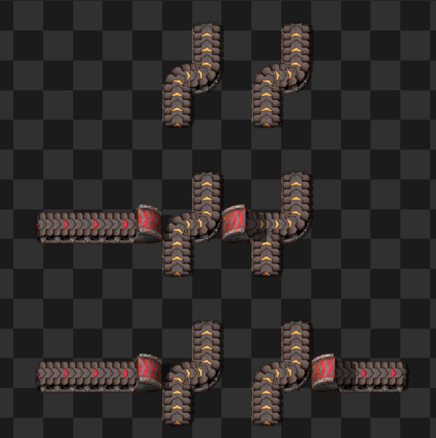

# Smart Belt Specification

## Goals

Enable players to drag belts over obstacles with intuitive, reliable behavior.

Inspiration and sources for this spec include:

- Many smart belt bug reports, which indicate a desire for different behavior. Some highlights:
  - https://forums.factorio.com/viewtopic.php?t=126645
  - https://forums.factorio.com/128742
  - https://forums.factorio.com/128715
  - https://forums.factorio.com/viewtopic.php?t=128845
  - https://forums.factorio.com/viewtopic.php?p=672248
  - https://forums.factorio.com/viewtopic.php?p=675773
- Several discussions with players (especially Factorio Speedrunners), about what should happen in specific situations
- A good think about what makes a smart belt "smart"

### Basic Requirements

- Belt drags in a straight line and automatically places underground belts over obstacles.
- Player is notified when belt lines cannot be completed for any reason.
- Supports dragging belt in forwards and reverse directions.
- Supports rotation of the current drag.
- Incorporates existing compatible belts, splitters, and underground belts going in the same direction as the drag if possible; flipping, rotating, and upgrading them as needed.
  - This allows flipping and existing belt.
- All behavior should be easily understood.

### Desired Properties

Tries to pinpoint what it means for smart belt to be "correct". Try comparing these with the above bug reports:

- **Continuity**: In the absence of "errors", belt lines are continuous and unbroken; the start of a drag will always be belt-connected to the end of the drag.
- **Complete**: Creates a valid belt line if possible (from below rules). Always notifies the player with an error if not.
- **Non-interference**: ALL non-integrated entities and belts should be untouched. This means not changing the rotation of another belt.

### Other desirable properties

- Supports belt weaving (underground belts of different tiers don't interfere).
- New underground belts are always placed as a pair; no lonely underground belts.
- Behavior allows:
  - "naturally" continuing existing belt lines.
  - fixing broken underground belts.
- In an error state due to an un-placeable underground belt, the entrance underground belt should be removed

#### Unpaired underground belts

Currently, this spec treats unpaired underground belts like belts, and can be easily over-built.
This which might break existing side-loads.
Supporting the former (preserving side loads) would be more complicated, and not much of a value add.
We'll relegate this to a potential future extension

### Future Extensions?

- Support un-rotating by pressing rotate twice on the original pivot point.
- Support interactions with ghost belts.
- Smarter lonely underground belt behavior

## Obstacle classification examples

This are some examples of what counts as an obstacle, detailed later in this spec.

All examples are when dragging left to right.

Images generated using [Factorio-Sat](https://github.com/R-O-C-K-E-T/Factorio-SAT), which is licensed under GNU GPL.
Made simple modifications to get it to work with 2.0.

**Non-obstacles.**
These should be integrated into the belt line.

```fac-img

 _ _ l _ r
 _ _ l r r l

_ l l l l l
_ r r r r r

_ r ri _ ro r
_ l lo _ li l
_ l ri _ ro l


_ _ r rs r r


ri _ ro rs ri _ ro


_ _ _ rs rs
```

**Obstacles**:
These should be under grounded over.


```fac-img

_ X _ _

_ l

_ r u l

_ u l _ _

_ _ u _ _ u
_ r u _ r u _
_ u _ _ u

_ d l l l _

_ d l l l _
_ r r r u _

_ _ _ ls


_ _r r rs
_ _u


_ _ rs r r d


_ _ rs X
```

For this red belt can underground over it, allowing belt-weaving.

```fac-img
_ _ _ _  _ _ _ _  d _
_ d l lo _ _ _ li l
_ d

```

**Impassable obstacles**
These are _not possible_ to underground over;
the player will be notified with an error (X is in the way) if they try to drag a belt pass them.

```fac-img

_ l lo _ li X _

_ _ _  _  d
_ d lo li l
_ d

_ ri _ ro rs X

```


**Running into a curved belt**
Running into an _existing belt_ in the same direction, will force it to be integrated.
However, if the existing belt then curves, since we don't know what to do, we don't touch the rotated belt, and give an error to the player.

```fac-img

_ _ r u
_ _ r d

_ _ ri _ ro u


_ _ r rs r u

```

**More examples**
Some notable before and after examples.
```fac-img

_ _  u _ l

r ri u ro r r


_ _ rs X _ _


r ri rs X ro r

_ _ r u l _ _

r r ri u ro r r _


_ _ ri _ ro _ _

r r ri _ ro r r

```

This behavior is TBD, depending on how we want to handle the splitter (to be debated):
```fac-img


_ _ r r rs X r

r r r ri rs X ro r _

```

We should consider these examples also in every rotation, mirroring, and dragging backwards.

## Obstacle/tile classification

After some fiddling and experimenting;
here are the rules, that are hopefully understandable, cover all "obvious" cases, and settle less obvious ones.

Some definitions:
- **Belt-like entity**: a belt, ug belt, or splitter (including 1x1)
- **Belt segment**: is a series of directly connected belts, underground belts, and splitters; only considering entities in the path of the current belt drag.
  Side-loading does not count towards belt segment connectivity.

### Informally
For every tile:

If you can't place belt on it, it's an obstacle or impassable obstacle.
Perpendicular belts-like entities, and backwards splitters are always obstacles.

**Belt segment integration**:
For an existing belt segment:
- If we connect _directly_ into it, we _always_ integrate it (starts with a belt in the same direction, or a ug entrance belt in the shape direction)
- If we can't connect into it, it's an obstacle.
If we have a choice to use a belt segment or not:
- If the belt segment ends in a splitter we can't exit, it's not integrated.
- if it's possible to integrate the _entire belt segment_, we integrate it

**Impassable obstacles**
All these create impassable obstacles:
- The tile doesn't allow under-grounding through
- If we are dragging over an existing integrated belt segment, and the end of the belt segment curves
- If we encounter a underground belt of the _same_ tier and axis that we aren't integrating, as we can't place undergrounds over an underground we aren't using... Distinguishing by tier allows for belt weaving.
- Trying to upgrade an underground in a way that will make it too short, or break belt weaving

**Variations**:
Here are some things we're not 100% sure about, and might consider:
- Forwards belt should not _always_ be force integrated (use some other logic)
- Forwards splitters might not be given special treatment (just treated as force-integrated)

### Tile Types
Getting in to the gritty details

Every tile is classified as exactly one of:

- **Empty**: All tiles where belt can be placed or fast-replaced. May end up being either a belt or a newly placed underground.
- **Integrated output**: Existing splitter, or output underground belt, that must be used. Can't be replaced with underground belt.
- **Pass-through**: An integrated input underground, or tiles inbetween an integrated underground pair. We ignore what's on it until we reach the exit underground.
- **Obstacle**
- **Impassable**

The very first belt successfully placed is always considered **Empty**

### Belt segments

Checking if we can use a belt segment. It will either be fully integrated, or treated as an obstacle.
```python

def belt_segment_connects(a, b): return if a and b connect to each other

def check_belt_segment_enter():
    # Consider the whole belt segment (traverse belt_segment_connect forward).
    if any part of the segment contains a curved belt -> False // not integrable
    else if it ends with a splitter, but the output is blocked -> False
    else -> True
```

### Main classification: simple obstacles

This handles the cases when the last tile was:
- **Empty**
- **Integrated output**
- **Obstacle**

Here comes a giant match statement

```python
was_successful_placement = last_type in (Empty, IntegratedOutput)
is_same_segment = belt_segment_connects(last_tile, current_tile)

match next_tile_type:
  case belt:
    match belt.direction:
      case perpendicular:
        if is_same_segment -> Impassable # this is the running into a curved belt case!
        else -> Obstacle
      case same direction:
        if belt_was_curved() -> Obstacle # curved belts are obstacles.
        else if was_successful_placement -> Empty # if belt runs into another belt, _always_ use it.
        else -> try_enter_belt_segment()
      else -> # opposite direction
        try_enter_belt_segment()
  case underground_belt:
    if belt.is_unpaired
      if belt.direction perpendicular -> Obstacle
      else -> Empty # Fast replace un-paired undergrounds. Insert logic here if we want to do something different
    else: match belt.shape_direction:
      case perpendicular -> Obstacle
      case inputting ->
        if was_successful_placement -> try_integrate_underground()
        else -> try_skip_underground()
      case outputting -> # running into the back of the underground
        try_skip_underground()
  case splitter: # including 1x1 splitters
    if splitter.direction != drag_direction -> Obstacle
    else if not was_successful_placement -> Obstacle # can't enter
    else: # same direction. Note: currently don't treat "directly running into a splitter" the same way as belt
        try_enter_belt_segment_splitter()
  case loader, linked belt, ...:
    if belt connects into it -> Impassable # Join to it, but don't underground it
    else -> Obstacle
  else: # not a belt like entity
    if belt can be placed -> Empty
    else if not an undergroundable tile -> Impassable
    else -> Obstacle

def try_enter_belt_segment():
  if check_belt_segment_enter() -> Empty
  else -> Obstacle

def try_enter_belt_segment_splitter():
  if check_belt_segment_enter() -> IntegratedOutput
  else -> Obstacle

# these are for undergrounds in the same direction as the current belt line
def try_integrate_underground():
  if is same tier -> PassThrough
  else:
    if upgrading would make underground too short -> Impassable
    if any tiles in between the underground are same-axis undergrounds of the same tier -> Impassable
    else -> PassThrough

def try_skip_underground():
  if same-tier underground -> Impassable # We can't underground over the same
  else -> Obstacle # this case allows belt weaving
```


#### Belt curvature
(For belt_was_curved())

Belt curvature is considered **ignoring** newly placed belts from the current drag.
See this example:


In the middle, a partial underground is placed, which temporarily straightens a belt. However, the straightened belt should still be considered inaccessible.

### Skipping over undergrounds

When last tile is **PassThrough**:
- if the next tile is the corresponding output underground -> IntegratedOutput
  else -> PassThrough

## Straight-Line Dragging

Goes into detail about dragging in a straight line, and traversing obstacles.

### Informally
Integrate compatible belts, splitters, and pass-through undergrounds.
Place underground belts over obstacles; Keep track of the last valid input underground position.
If encountering an impassable obstacle, or underground belt would be too long, notify the user.

Never affect non-integrated entities.

### More formally

TODO: another giant match statement

## Error recovery

TODO: refine this

What do do when we cannot continue:

- If due to trying being unable to place/extend an underground belt, remove the underground belt entrance. This is so we don't side load/curve into anything.
- If due to a pass-through underground we cannot upgrade, do not upgrade the underground belt.
- IF the output is blocked, notify the player that "X is in the way."

## Placing and overlapping entities

Final notes on placing and "overlapping" existing entities:

- **Empty space**: Create the entity.
- **Compatible belts/underground belts**: Rotate, upgrade, or fast-replace as needed.
- **Compatible splitters**: Rotation should not be necessary. TBD: Should we also upgrade the splitter? It currently doesn't today.

## Full dragging and rotation

Logic for the full "drag lifecycle": starting, rotating, and "un-dragging".

### Starting a Drag

A drag starts when the player places and holds down a belt.
A drag is created in the same line as the belt.
Dragging forwards or backwards determines the belt orientation.
Un-dragging backwards changes the belt orientation.

### Fast Replace on the First Entity

The very first click is special: it may fast replace something (such as replace a splitter with a belt, or remove an underground).
This behavior is independent from any other rules. This allows the user to override any behavior by clicking another time.
If a fast replace is done, this may also create a separate undo/redo item; allows recovering from "accidental" dragging.

### Rotation

When pressing rotate in the middle of a drag, determine the direction (left/right) by where the cursor, and the belt orientation (forwards/backwards) as what it was previously.

If the "pivot tile" is a belt: first rotate it to the correct direction if needed, whatever the previous direction was!

Then, it's the same as starting a new drag.

## Other Feature Interactions

### Undo/Redo Stack

These should separate undo items:

- The very first belt's fast replace if applicable.
- Each "segment" of a a drag; rotation ends the current segment and starts a new one

### Ghosts and ghost building

- **Real belt dragging**: Ghosts completely ignored.
  - Future enhancement: Interactions with ghosts?
- **Ghost belt dragging**: Both ghosts and real entities considered.

This is considered one entity at a time, at the time when you placed the belt.

TODO: exceptions

### Force building

This always results in ghost placement.

Force is only different from normal ghost placement, in that rocks and trees are no longer considered obstacles.

### SUPER force building

If using super force, any potential obstacles, belt or otherwise, are either deleted (if not a belt) or force-integrated
(if it happens to be the correct type);
then treated as integrable belt for the rest of this spec.

If you release super-force, future encountered entities are treated normally again.

TODO: formalize this

### Entities Marked for Deconstruction

For deconstructed entities:
- **Real entity dragging**:
  - if it is possible to fast-replace with a straight belt, this is done; and the belt is un-deconstructed
  - otherwise, treated _normal_ obstacles. Underground belt interactions are ignored
- **Ghost dragging**: Deconstructed entities completely ignored.

TODO: formalize this

### Player Interactions

- **Material shortage**: running out of real belts ends the drag.
- **Insufficient underground belts**: Creates ghosts instead (with error notification). This will also mine the input underground belt position to prevent accidental sideloads.
- **Upgrades**: Either places upgraded materials or marks for bot upgrade, depending on whether ghost dragging is active and whether the player has enough materials.
